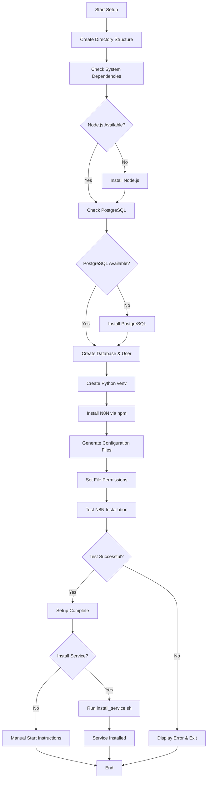

# N8N PostgreSQL Setup - GitHub Repository Plan

## Overview
Create a comprehensive GitHub repository for n8n production setup with:
- PostgreSQL database integration
- Custom workflows directory
- Configurable port
- Production-ready configuration
- Optional systemd service installation
- Virtual environment isolation

**Repository:** `https://github.com/codemonkeying/n8n_postgresql`

## GitHub Repository Structure
```
n8n_postgresql/
├── README.md                  # Main documentation
├── LICENSE                    # MIT License
├── .gitignore                # Git ignore file
├── CHANGELOG.md              # Version history
├── CONTRIBUTING.md           # Contribution guidelines
├── scripts/
│   ├── n8n_setup.sh         # Main setup script
│   ├── install_service.sh   # Optional systemd service installer
│   └── uninstall.sh         # Uninstall script
├── config/
│   ├── .env.example         # Environment variables template
│   ├── n8n.config.js        # N8N configuration template
│   └── systemd/
│       └── n8n.service      # Systemd service file template
├── docs/
│   ├── installation.md      # Installation guide
│   ├── configuration.md     # Configuration options
│   ├── troubleshooting.md   # Common issues and solutions
│   └── security.md          # Security best practices
├── examples/
│   ├── workflows/           # Sample workflows
│   └── docker-compose.yml   # Optional Docker setup
└── tests/
    ├── test_setup.sh        # Setup validation tests
    └── test_database.sh     # Database connection tests
```

## Implementation Plan

### Phase 1: Environment Setup
1. **Directory Structure Creation**
   - Create `/home/user/n8n/` with subdirectories
   - Set appropriate permissions

2. **Python Virtual Environment**
   - Create isolated Python venv
   - Install required Python dependencies if needed

### Phase 2: System Dependencies
1. **Node.js & NPM Setup**
   - Verify Node.js installation (v18+ required)
   - Install/update npm if needed

2. **PostgreSQL Setup**
   - Install PostgreSQL server
   - Create dedicated n8n database and user
   - Configure authentication

### Phase 3: N8N Installation & Configuration
1. **N8N Installation**
   - Install n8n globally via npm
   - Configure environment variables
   - Set up database connection

2. **Configuration Files**
   - Create `.env` with database credentials, port, workflows path
   - Generate secure encryption key
   - Configure logging and security settings

### Phase 4: Production Hardening
1. **Security Configuration**
   - Set up proper file permissions
   - Configure firewall rules (optional)
   - Enable HTTPS support preparation

2. **Monitoring & Logging**
   - Configure log rotation
   - Set up health check endpoints

### Phase 5: Service Management
1. **Systemd Service Creation**
   - Create systemd unit file
   - Configure auto-restart and dependency management
   - Separate optional installer script

## Configuration Details

### Environment Variables (.env)
```bash
# Database Configuration
DB_TYPE=postgresdb
DB_HOST=localhost
DB_PORT=5432
DB_DATABASE=n8n_db
DB_USERNAME=n8n_user
DB_PASSWORD=<generated_password>

# N8N Configuration
N8N_PORT=5678
N8N_HOST=0.0.0.0
WEBHOOK_URL=http://localhost:5678
N8N_USER_FOLDER=/home/user/n8n
WORKFLOWS_FOLDER=/home/user/n8n/workflows

# Security
N8N_ENCRYPTION_KEY=<generated_key>
N8N_USER_MANAGEMENT_DISABLED=false

# Logging
N8N_LOG_LEVEL=info
N8N_LOG_OUTPUT=file
N8N_LOG_FILE_LOCATION=/home/user/n8n/logs/
```

### Systemd Service Features
- Automatic startup on boot
- Restart on failure
- Proper user isolation
- Environment file loading
- Dependency on PostgreSQL service

## Setup Flow Diagram



## Script Features

### Main Setup Script (n8n_setup.sh)
- Interactive prompts for configuration
- Automatic dependency detection and installation
- Database setup with secure password generation
- Configuration validation
- Rollback capability on failure
- Comprehensive logging

### Service Installer (install_service.sh)
- Optional systemd service installation
- Service status checking
- Enable/disable service management
- Log file monitoring setup

## Security Considerations
- Generated secure passwords and encryption keys
- Proper file permissions (600 for config files)
- Database user with minimal privileges
- Optional firewall configuration prompts
- HTTPS preparation for production deployment

## GitHub Repository Features

### Documentation
- **README.md**: Comprehensive project overview with quick start guide
- **Installation Guide**: Step-by-step installation instructions
- **Configuration Guide**: Detailed configuration options
- **Troubleshooting**: Common issues and solutions
- **Security Guide**: Production security best practices

### Scripts Organization
- **Main Setup Script**: `scripts/n8n_setup.sh` - Interactive installation
- **Service Installer**: `scripts/install_service.sh` - Systemd service setup
- **Uninstaller**: `scripts/uninstall.sh` - Clean removal of n8n setup
- **Test Scripts**: Validation and testing utilities

### Configuration Templates
- **Environment Template**: `.env.example` with all configuration options
- **Service Template**: Systemd service file for production deployment
- **N8N Config**: JavaScript configuration file template

### Examples and Samples
- **Sample Workflows**: Ready-to-use workflow examples
- **Docker Compose**: Alternative containerized deployment option

## Repository Implementation Plan

### Phase 1: Repository Structure
1. Create base directory structure
2. Initialize Git repository
3. Create core documentation files (README, LICENSE, CONTRIBUTING)
4. Set up .gitignore for Node.js/Python projects

### Phase 2: Core Scripts Development
1. Main setup script with interactive prompts
2. Database setup and configuration
3. N8N installation and configuration
4. Service management scripts

### Phase 3: Documentation
1. Comprehensive README with badges and quick start
2. Detailed installation and configuration guides
3. Troubleshooting documentation
4. Security best practices guide

### Phase 4: Testing and Examples
1. Setup validation tests
2. Database connection tests
3. Sample workflows
4. Docker compose alternative

## Usage Instructions

1. Clone the repository:
   ```bash
   git clone https://github.com/codemonkeying/n8n_postgresql.git
   cd n8n_postgresql
   ```

2. Run the main setup script:
   ```bash
   chmod +x scripts/n8n_setup.sh
   ./scripts/n8n_setup.sh
   ```

3. Optionally install systemd service:
   ```bash
   chmod +x scripts/install_service.sh
   ./scripts/install_service.sh
   ```

4. Start n8n:
   ```bash
   # If service installed:
   sudo systemctl start n8n
   
   # Manual start:
   source venv/bin/activate
   n8n start
   ```

## Post-Installation
- Access n8n at `http://localhost:5678`
- Configure initial admin user
- Import/create workflows from examples directory
- Monitor logs and configure backups
- Follow security guide for production deployment

## Repository Maintenance
- Version tagging for releases
- Changelog maintenance
- Issue templates for bug reports and feature requests
- Pull request templates for contributions
- GitHub Actions for automated testing (future enhancement)